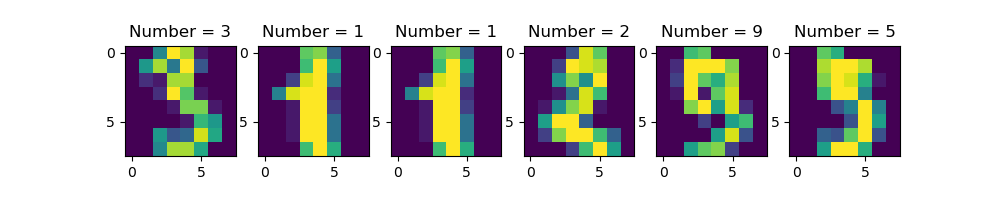

# Showcasing Birth Date in 8px Digit Images using SK Learn *Digits Toy Dataset*
This repo is using digits toy dataset provided by Sci-kit Learn [*check this link*](https://scikit-learn.org/stable/modules/generated/sklearn.datasets.load_digits.html#sklearn.datasets.load_digits)
1. Clone this repo and *run* the program. 

2. Input your birthdate in **ddmmyy** format

3. A screenshot of how the output image will look like:
    

### **_Enjoy!_**

#

#### Albertus Rianto Wibisono ✉ _albertusrian95@gmail.com_

[Instagram](https://www.instagram.com/rian__wibisono) | 
[LinkedIn](https://www.linkedin.com/in/albertusrian95/) |
[GitHub](https://www.github.com/RiantoWibisono)
